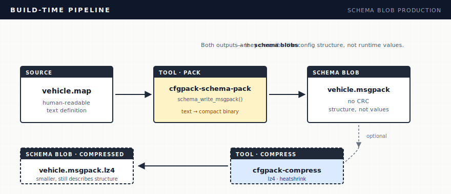

# Data Flow & Lifecycle

This document describes how data flows through cfgpack from build time to
device runtime, and how the two blob formats interact during boot and firmware
upgrades.

## Two Blob Formats

CFGPack uses two distinct binary formats. They are not interchangeable.

| | Schema blob | Config blob |
|---|---|---|
| **Produced by** | `cfgpack_schema_write_msgpack()` / `cfgpack-schema-pack` tool | `cfgpack_pageout()` |
| **Consumed by** | `cfgpack_schema_parse_msgpack()` | `cfgpack_pagein_buf()` / `cfgpack_pagein_remap()` |
| **CRC-32C** | No | Yes (4-byte little-endian trailer) |
| **Contains** | Entry definitions (indices, names, types, defaults) | Runtime values keyed by index |
| **When used** | Boot — load schema from firmware image | Runtime — persist and restore config values |
| **Compression** | Decompress with LZ4/heatshrink directly | `cfgpack_pagein_lz4()` / `cfgpack_pagein_heatshrink()` |

## Build-Time Pipeline

Author schemas as `.map` text files, then convert to compact binary at build
time. The device loads the binary directly — no text parsing needed.



Both the uncompressed and compressed files are **schema blobs** — they
describe the config structure, not runtime values.

## Device Boot Lifecycle

Every boot follows the same initial steps regardless of whether config
exists in flash. After shared schema initialization, one of three paths
runs depending on what's in flash.


### First Boot

On first boot there is no saved config in flash. After `cfgpack_init()`,
all entries with schema defaults are automatically marked present. The
application runs with defaults and eventually calls `cfgpack_pageout()`
to persist any modified values.

No pagein call is needed. CRC is not involved.

### Same-Version Boot

The flash contains a config blob previously written by `cfgpack_pageout()`.
Call `cfgpack_pagein_buf()` to load it. CRC-32C is verified automatically —
if the blob is corrupt, `CFGPACK_ERR_CRC` is returned and the application
can fall back to defaults.

### Firmware Upgrade

The flash contains a config blob from an older schema version. The new
firmware:

1. Loads its own (new) schema — this happens regardless of migration
2. Calls `cfgpack_peek_name()` on the flash blob to identify the old version
3. Selects the appropriate remap table for that version
4. Calls `cfgpack_pagein_remap()` with the remap table to load old values
   into the new context, translating indices as needed

Type widening (e.g., u8 → u16) is handled automatically. Entries removed
in the new schema are silently skipped. New entries keep their schema
defaults.

See [Schema Versioning](versioning.md) for remap table details and
[`examples/fleet_gateway/`](../examples/fleet_gateway/) for a complete
three-version migration chain.

## Schema Decompression

The decompress functions `cfgpack_pagein_lz4()` and
`cfgpack_pagein_heatshrink()` decompress **and then load config values**
via `cfgpack_pagein_buf()`. They are not general-purpose decompression —
they expect the decompressed result to be a config blob with a CRC-32C
trailer.

For compressed **schemas**, call the decompression library directly and
then use the schema parse APIs:

```c
/* Decompress schema blob */
LZ4_decompress_safe((const char *)compressed, (char *)scratch,
                    (int)compressed_len, (int)decompressed_size);

/* Measure and parse the decompressed schema */
cfgpack_schema_measure_msgpack(scratch, decompressed_size, &m, &err);
/* ... allocate buffers from m ... */
cfgpack_schema_parse_msgpack(scratch, decompressed_size, &opts);
```

See [`examples/fleet_gateway/`](../examples/fleet_gateway/) for the
complete pattern with LZ4-compressed msgpack schemas.
